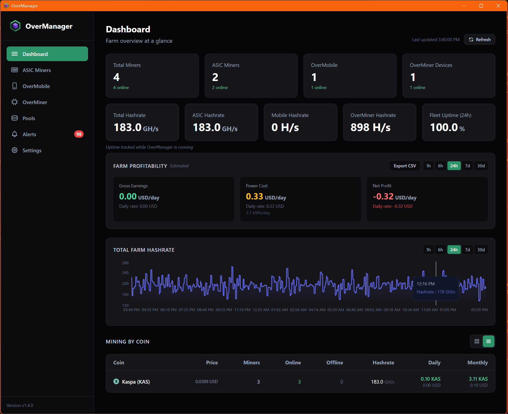

# PoPManager

**Open-source, cross-platform miner management software for ASIC and mobile miners**

Built by [Proof of Prints](https://proofofprints.com) | [Support: support@proofofprints.com](mailto:support@proofofprints.com)

## Overview

PoPManager is a free, open-source desktop application for monitoring and managing your cryptocurrency mining operation. Built with Tauri (Rust + React), it runs on Windows, Linux, and macOS without requiring a dedicated mining OS.

Manage ASIC miners on your local network *and* mobile miners running **PoPMiner Mobile** *(coming soon)* on Android — all from one unified dashboard. Monitor hashrates, temperatures, battery levels, profitability, and manage pool configurations across your entire fleet.

## Screenshots



## Features

### ASIC Miner Management
- **Multi-manufacturer support:**
  - **IceRiver** — Full monitoring and control (KS0, KS0 Pro, KS1, KS2, KS3, KS5)
  - **Whatsminer/MicroBT** — Monitoring support (M50, M56, M60, M66 series)
  - **Bitmain Antminer** — Read-only monitoring on stock firmware (S19, S21 series)
- Network scanner with auto-detection of miner manufacturer and subnet
- Card and data grid views with search, sort, filter by coin/manufacturer/model/pool
- Per-miner detail pages with hashrate charts, board temps, fan speeds
- Bulk pool configuration — select multiple miners and apply a pool profile at once
- Open miner web UI directly from the app
- Uptime tracking (24h/7d/30d per miner and fleet-wide)


### Mobile Miner Management

PoPManager includes an embedded HTTP server that receives push-based telemetry from mobile miners running **PoPMiner Mobile** *(coming soon)* on Android. Mobile miners pair with a single-use 6-digit pairing code and then report telemetry every 30 seconds over your local network.

- **Dedicated Mobile Miners screen** with the same card/grid views, search, filters, and sorting as the ASIC page
- **Real-time telemetry:** hashrate (auto-scaled H/s through GH/s), CPU temperature, thermal throttle state, battery level with charging indicator, accepted/rejected shares, active pool
- **Remote control panel** — Start, Stop, Restart mining remotely from PoPManager
- **Remote configuration** — push pool URL, wallet, worker, and thread count to any mobile device via queued commands
- **Command queue with acknowledgement** — commands are delivered on the device's next report cycle; offline devices receive them when they reconnect
- **Device pairing** — single-use 6-digit pairing code displayed in the app; code rotates automatically after each successful pairing for security
- **Push to Mobile Miners** — apply any saved pool profile to selected mobile devices directly from the Pools page
- **Mobile-specific alerts** — battery low, CPU temperature high, thermal throttle, device offline
- **Device removal** — queue cleanup commands (stop mining + clear config) before removing a device, with a confirmation prompt explaining the process

<!-- Screenshots for mobile miner screens — replace these placeholders with actual screenshots -->
<!--  -->
<!--  -->
<!--  -->

### Multi-Coin Support
- Built-in support for **Kaspa (KAS)** and **Bitcoin (BTC)**
- Modular coin registry — easily add new cryptocurrencies
- Per-coin profitability calculations using live market data

### Dashboard
- Farm-level overview with miner counts and hashrates split by type (Total / ASIC / Mobile)
- Per-coin earnings breakdown with configurable time windows (1h, 6h, 24h, 7d, 30d)
- Fleet hashrate chart with historical data (1h to 30 days)
- Fleet uptime percentage (24h rolling)
- Welcome screen on first launch with quick-start guidance
- Real-time miner status across your entire operation

### Profitability Tracking
- Live coin prices via CoinGecko (12+ fiat currencies supported)
- Electricity cost calculation with per-model wattage
- Pool fee configuration (per-pool or global default)
- Selectable time window — view estimated earnings per hour, per day, per week, or per month
- Daily/monthly gross, power cost, and net profit estimates

### Alerts & Notifications

**ASIC alert rules:**
- Hashrate drop below threshold
- Board temperature above threshold
- Miner offline (consecutive missed polls)
- No shares submitted within time window

**Mobile alert rules:**
- Battery level below threshold (when not charging)
- CPU temperature above threshold
- Thermal throttle state (moderate/severe/critical)
- Device offline (consecutive missed reports)

**Notification channels:**
- Desktop notifications (branded PoPManager alerts on Windows)
- Email alerts via SMTP (SendGrid, Gmail, or any SMTP provider)
- Alert history with acknowledge/dismiss workflow
- 5-minute startup grace period prevents false alerts after PoPManager restarts


### Pool Management
- Saved pool profiles with per-pool fee percentages and coin association
- **Unified miner view** — see both ASIC and mobile miners connected to each pool, with slot indicators (Primary / Backup 1 / Backup 2)
- **Push to Mobile Miners** — select mobile devices and queue a pool configuration change directly from the pool detail page
- Bulk apply pool configurations to ASIC miners

### Data & Export
- CSV export: miner list, alert history, profitability reports, farm history
- Uptime tracking (24h/7d/30d per miner and fleet-wide)
- Historical farm data with auto-pruning (7-day retention)
- Troubleshooting logs with configurable log levels

### Desktop Integration
- System tray mode — minimize to tray for background monitoring
- Auto-update support via GitHub Releases (cross-platform: Windows, macOS, Linux)
- Native Windows notifications


## PoPMiner Mobile *(coming soon)*

**PoPMiner Mobile** is a companion Android app that turns your phone or tablet into a Kaspa miner and reports telemetry back to PoPManager over your local network.

- Mine Kaspa (KAS) using your device's CPU
- Automatic server discovery via pairing code — no manual IP configuration
- Receives remote commands from PoPManager: start, stop, restart, change pool/wallet/threads
- Reports telemetry every 30 seconds: hashrate, CPU temp, battery, throttle state, pool stats
- Works offline — queued commands are delivered on reconnect

The app is currently in development. Follow the [GitHub repo](https://github.com/proofofprints/PoPManager) for release announcements.

## Installation

Download the latest installer for your platform from [Releases](https://github.com/proofofprints/PoPManager/releases):

| Platform | Format | Notes |
|---|---|---|
| **Windows** (x64) | `.msi` installer | Fully tested. See [First Launch on Windows](#first-launch-on-windows). |
| **macOS** (Apple Silicon) | `.dmg` (aarch64) | Community-tested. |
| **macOS** (Intel) | `.dmg` (x64) | Community-tested. |
| **Linux** (x64) | `.deb` or `.AppImage` | Community-tested. Requires `webkit2gtk 4.1` and related system libraries. |

> **Note:** Windows is the primary development and testing platform. macOS and Linux builds are provided and should work, but have not been as extensively tested. Please [open an issue](https://github.com/proofofprints/PoPManager/issues) if you encounter platform-specific problems.

### Building from Source

Prerequisites:
- [Node.js](https://nodejs.org/) (v18+)
- [Rust](https://rustup.rs/) (stable toolchain)
- [Visual Studio Build Tools](https://visualstudio.microsoft.com/downloads/) (Windows, with C++ workload)

```bash
git clone https://github.com/proofofprints/PoPManager.git
cd PoPManager
npm install
npm run tauri dev
```

To create a production build:
```bash
npm run tauri build
```

## Quick Start

### ASIC Miners
1. **Launch PoPManager** and open the **ASIC Miners** tab in the sidebar
2. Click **Add Device** to open the discovery panel
3. Click **Scan Network** — PoPManager will auto-detect your local subnet and find supported miners
4. Select the miners you want to monitor and click **Add to Monitored**
5. Go to **Pools** to create a pool profile with your pool address and wallet
6. Select miners on the ASIC Miners page and click **Apply Pool Profile** to push the config
7. Check the **Dashboard** for your farm overview and profitability estimates

### Mobile Miners (PoPMiner Mobile)
1. Enable the mobile miner server in **Settings → Mobile Miner Server**
2. Open the **Mobile Miners** tab and click **Add Device** to reveal the server URL and pairing code
3. In PoPMiner Mobile, enter the server URL (e.g. `http://192.168.1.50:8787`) and the 6-digit pairing code
4. Once paired, the device will appear in the Mobile Miners list and begin reporting telemetry
5. Use the **Remote Control** panel on any mobile miner's detail page to start, stop, or reconfigure mining
6. Use the **Push to Mobile Miners** action on any Pool profile to configure multiple mobile devices at once

## First Launch on Windows

**SmartScreen warning:** Because PoPManager v1 is distributed without an Authenticode code-signing certificate, Windows SmartScreen will display an "unrecognized app" warning the first time you run the installer. This is expected. Click **More info** on the warning dialog, then **Run anyway** to proceed. Subsequent launches will not show the warning on the same machine. Code signing is planned for a future release.

**Firewall prompt:** PoPManager can run an embedded HTTP server on port 8787 for mobile miner telemetry. The server is **disabled by default** — enable it in **Settings → Mobile Miner Server** if you plan to use PoPMiner Mobile. When enabled, Windows Defender Firewall will prompt you to allow PoPManager to accept incoming connections on that port.

## Adding New Coins

PoPManager is designed to be modular. See [docs/ADD_NEW_COIN.md](docs/ADD_NEW_COIN.md) for instructions on adding support for new cryptocurrencies.

## Supported Miners

See [docs/SUPPORTED_MINERS.md](docs/SUPPORTED_MINERS.md) for the full list of supported miner models and features.

## Configuration

All configuration is stored locally on your machine. On Windows, data is split across two locations:

**App data (`%LOCALAPPDATA%\PoPManager\`)** — most operational state:
- `miners.json` — saved ASIC miners
- `mobile_miners.json` — registered mobile miners
- `mobile_miner_commands.json` — pending remote commands
- `mobile_server_config.json` — mobile server settings + pairing code
- `alert_rules.json`, `alert_history.json` — alert configuration and history
- `pool_profiles.json` — pool profiles
- `coins.json` — configured cryptocurrencies
- `smtp_config.json` — email notification settings

**User data (`%APPDATA%\com.proofofprints.popmanager\`)** — preferences and time-series:
- `preferences.json` — currency, pool fee, electricity cost, log level, etc.
- `history.json` — farm hashrate snapshots
- `uptime.json` — per-miner uptime tracking

To fully back up your PoPManager setup, copy both directories. Logs live in `%APPDATA%\com.proofofprints.popmanager\logs\popmanager.log`.

On Linux and macOS the layout follows each platform's XDG/Application Support conventions automatically.

## Disclaimer

Profitability estimates are calculated based on current network difficulty, block rewards, coin prices, and configured pool fees. Actual earnings may vary due to pool luck, network difficulty changes, miner uptime, hardware efficiency, and market volatility. These figures are estimates only and should not be considered financial advice.

## License

MIT License — see [LICENSE](LICENSE) for details.

## Contributing

Contributions welcome! If you have a miner model not currently supported, please open an issue with your miner's API details. See [docs/SUPPORTED_MINERS.md](docs/SUPPORTED_MINERS.md) for guidance.

## Contact

- **Website:** [proofofprints.com](https://proofofprints.com)
- **Email:** [support@proofofprints.com](mailto:support@proofofprints.com)
- **GitHub:** [github.com/proofofprints/PoPManager](https://github.com/proofofprints/PoPManager)
